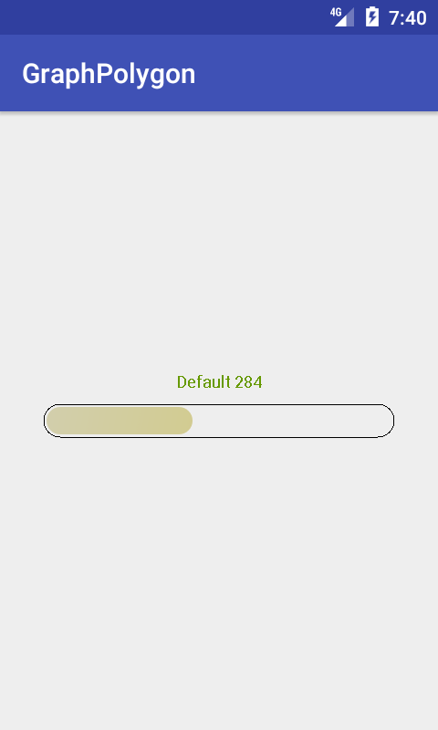

# Presentation

This library provide a tool to display a score into a graphic.


# Sample

```xml
 <ffournier.libscoregraphview.ScoreGraphView
        android:id="@+id/score_graph_view"
        android:layout_width="match_parent"
        android:layout_height="match_parent"
        app:textSizeTitle="12sp"
        app:colorLine="@android:color/black"
        app:colorTitle="@color/colorAccent"
        app:strokeWidth="1"
        app:animationEnabled="true"
        app:animationDuration="1000"/>
```

# Screenshot


Screenshot MainActivity


Screenshot 10 dimensions


Screenshot 2 dimensions


Screenshot 1 dimensions



Screenshot 3 dimensions

